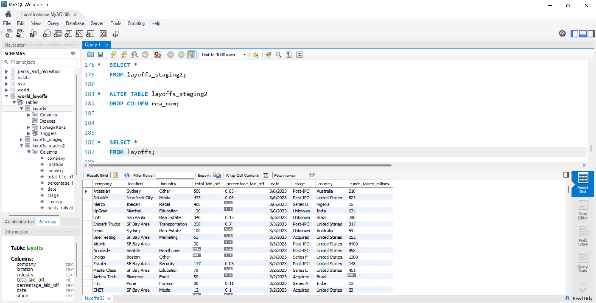
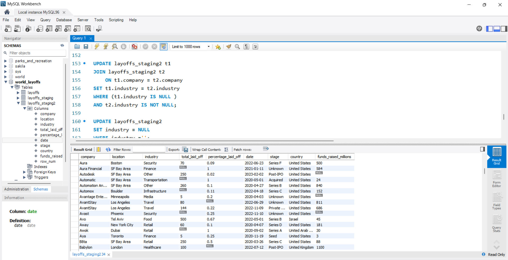

# Data Cleaning Project (SQL)

## Overview
This project focuses on cleaning and preparing a housing dataset using SQL.

## Skills Used
- Data Cleaning
- SQL
- Data Transformation

## Data Cleaning Process

The dataset was cleaned and transformed using SQL to improve data quality and prepare it for analysis.

### Before Cleaning
The raw dataset contained issues such as duplicate records, inconsistent formatting, and missing values, which could impact the accuracy of any analysis.

### After Cleaning
After applying data cleaning techniques, the dataset was standardised and structured. Duplicates were removed, missing values were handled, and data formats were made consistent, resulting in a clean dataset ready for analysis.

## Key Tasks
- Removed duplicates
- Handled missing values
- Standardised data formats

## Skills Used
- Data Cleaning
- SQL
- Data Transformation

## Tools
- SQL Server

## Author
Fowsiya Haji
